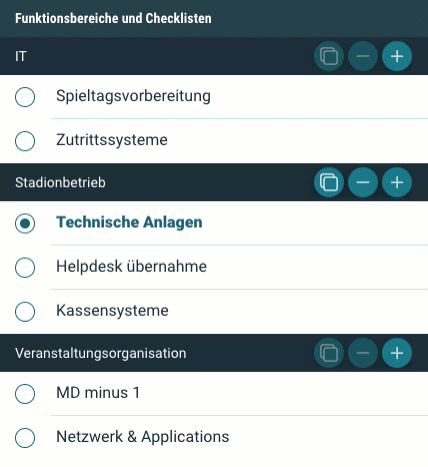
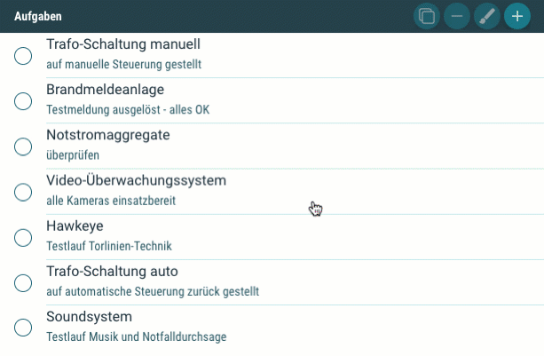
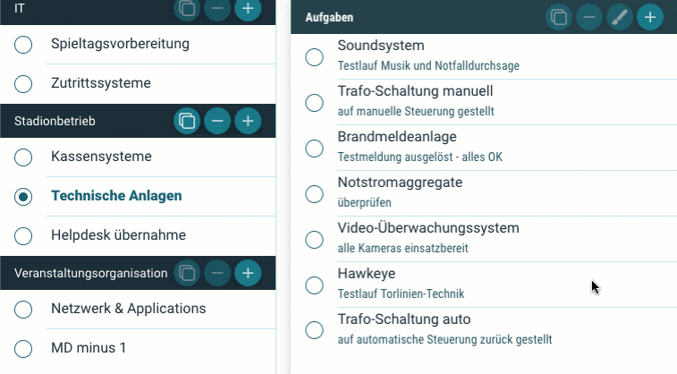
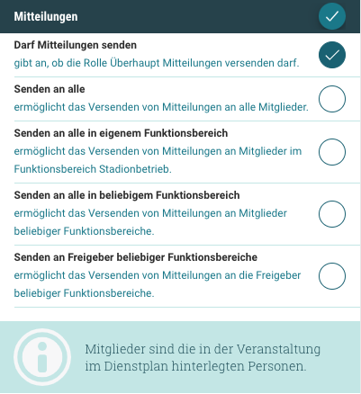
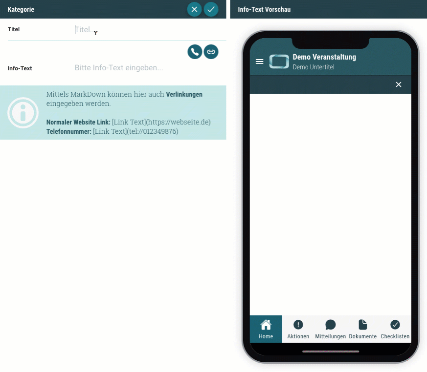
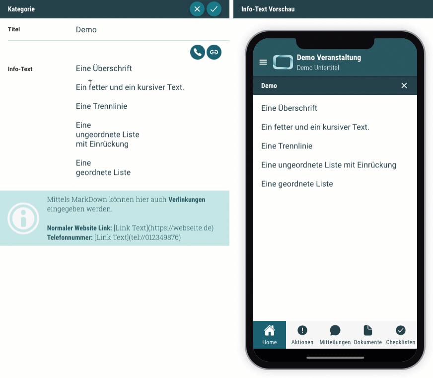
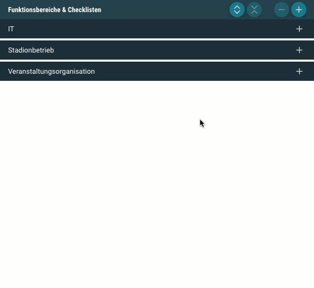
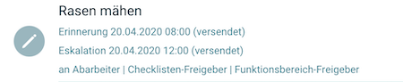

# Neuigkeiten aus Release 2020-04

* Desktop Client ab Version 1.4.0
* Mobile Client ab Version 1.9.0

## Erweiterungen der Checklisten
- **Erinnerung und Eskalationen mit fester Uhrzeit**  
Bisher war es immer nur möglich, die Erinnerungs- und Eskalationszeitpunkte der Aufgaben mit einem Zeitfenster X relativ zum Veranstaltungsbeginn oder Einlasszeitpunkt anzugeben. Auf vielfachen Wunsch können dabei jetzt auch feste Uhrzeiten angegeben werden, um sagen zu können: Bitte 3 Tage vor dem Spiel um 14:00 Uhr erinnern. Unabhängig davon, ob es ein Freitagabend- oder Sonntagnachmittag-Spiel ist.

- **Kommentarfunktion für OK-Aufgaben**  
In manchen Situationen kommt es vor, dass erledigte Aufgaben (OK-Status) mit einer zusätzlichen Bemerkung versehen werden sollen. Gegebenenfalls auch mit einem Bild. Dies ist nun möglich, indem man eine Aufgabe noch einmal anwählt.

- **Verschieben (und Kopieren) von Checklisten**  
Es ist nun möglich, in der Checklistenverwaltung ganze Checklisten zu kopieren und per Drag & Drop zu verschieben. Und dies auch in andere Funktionsbereiche. Damit werden Organisation und Optimierung der geplanten Abläufe deutlich vereinfacht.

  

- **Sortieren von Aufgaben**  
Innerhalb einer Checkliste können die Aufgaben nun ebenfalls per Drag & Drop neu sortiert werden. Damit ist es einfacher, die gedachte Abarbeitungsreihenfolge festzulegen, wenn gleich sich die Sortierung nicht auf die Erinnerungen und Eskalationen auswirkt.

  

- **Verschieben (und Kopieren) von Aufgaben**  
Analog zu den Checklisten können auch einzelne Aufgaben per Drag % Drop in andere Checklisten verschoben werden.

  

- **Layout-Optimierung in Checklistenverwaltung**  
Einhergehend mit der Drag & Drop Funktionalität wurde die bisherige Funktionsbereichsauswahl in der Checklistenverwaltung entfernt. Stattdessen werden nun alle Funktionsbereiche aufgelistet, auf die der Bearbeiter Zugriff hat. Dies ist übersichtlicher und erleichtert die Checklistenbearbeitung.
 
## Veranstaltungsphasen

- **_Veranstaltung beenden_ wird _Veranstaltung archivieren_**  
Wurden Veranstaltungen im Backend _beendet_, wurden Sie _archiviert_, sodass keinerlei Änderungen mehr möglich waren. Und gleichzeitig standen sie in der App nicht mehr zur Verfügung.   
Diese Funktion wurde umbenannt und heißt jetzt _Veranstaltung archivieren_.

- **_Veranstaltung beenden_ als neue Funktion**  
Veranstaltungen können jetzt durch den diensthabenden Veranstaltungsleiter offiziell beendet werden. Da dies aus Haftungssicht ein wichtiger Zeitpunkt ist, wird es auch explizit im Prüfbericht und als Status in der App berücksichtigt. 

- **Veröffentlichung zurückziehen**  
Bisher war es nicht möglich, bereits veröffentlichte Veranstaltungen noch einmal zurückzuziehen, sodass fehlenden Informationen nachgepflegt oder versehentlich getätigte Veröffentlichungen korrigiert werden konnten. Dies ist jetzt im Backend über die neue Funktion _Veröffentlichung zurückziehen_ möglich.

- **Automatische Prüfberichte**  
Es wird nun automatisch ein zweiter Prüfbericht erzeugt, sobald die Veranstaltung beendet wurde. Damit gibt es aktuell 2 Prüfberichte, einen zur Veranstaltungsfreigabe und einen zum Veranstaltungsende.

## Mitteilungen

- **Flexible Berechtigungen für Mitteilungen**  
Aktuell war das Versenden von Mitteilungen den Veranstaltungsleitern vorbehalten. Dieses starre Konstrukt wurde nun abgeschafft und durch Berechtigungen auf Rollen-Ebene ersetzt. Damit können Mitteilungen von jedem Mitarbeiter verschickt werden, sofern seine Rollenberechtigung dies vorsieht. Die Einstellung finden Sie in der _Funktionsbereiche und Rollen_ Seite im Backend.

  

## Info-Kategorien und Aktionen

- **Verlinkungen für Rufnummern und Webseiten**  
Einführung der Markdown-Formatierung (siehe https://markdown.de/): 
Ein mächtiges und gleichzeitig einfaches Werkzeug, um die leichtgewichtigen Info-Kategorien und Aktionen um individuelle Inhalte und Funktionalitäten aufzuwerten. So können insbesondere Rufnummern und Webseiten in einer einfachen Syntax angegeben werden, die dann in der App direkt angewählt werden können.

  

- **Erweiterte Formatierungen**  
Die Markdown-Syntax bringt auch weitere Formatierungsmöglichkeiten mit sich. Bisher konnten nur einfache, unformatierte Texte in Info-Kategorien und Aktionen verwendet werden. Mit Einführung der Markdown-Formatierung (siehe https://markdown.de/) lassen sich auch _Überschriften_, _Aufzählungslisten_ und Textschnitte wie _Fett_ und _Kursiv_ umsetzen.

  

## Authentifizierung
- **Gast-User zulassen**  
Nun können externe Mitarbeiter oder Dienstleiter ohne eigenes Benutzer-Konto beim Club über ihre Mail-Adresse im Azure Active Directory als Gastuser eingeladen werden und sich damit im ORGA App System anmelden.

## Allgemeine Verbesserungen & Bugfixes

- **Beschreibungsfeld der Aufgaben**  
Dieses ist nun auch in der Bearbeitungsmaske mehrzeilig, sodass die Eingabe der Beschreibungstexte leichter von der Hand geht.

- **Klappfunktion in Checklisten und Dienstplan**  
Benutzer mit Berechtigungen in mehreren Funktionsbereichen können durch die neue Klappfunktion besser den Überblick bewahren.

  

- **Transparentere Darstellung der Erinnerungen und Eskalationen**  
Die errechneten Erinnerungs- und Eskalationszeitpunkte werden nun innerhalb der Veranstaltung im Desktop Clients direkt unterhalb der Aufgabe dargestellt. Hier ist auch zu sehen, ob die Nachricht an die einzelnen Zielgruppen die Eskalationen versendet wird und ob dies schon geschehen ist.

     

- **Datumformat im Prüfprotokoll korrigiert**  
Der Meldezeitpunkt von Aufgaben wurde im Prüfprotokoll mit einer falschen Zeitzone formatiert, sodass der Zeitpunkt verschoben schien. Dies ist nun korrigiert.

- **Checklisten-Berechtigungen weitergeben**  
Wurden die Berechtigungen in den Checklistendefinitionen geändert, hatte dies keine Auswirkungen auf die bereits geplanten Veranstaltungen und man musste betroffenen Checklisten neu in die Veranstaltung laden. Jetzt werden die geänderten Einstellungen auch direkt dahin übernommen.

- **Fälschliche Aktivierung von Eskalationen behoben**  
Es kam vor, dass beim Administrieren von Aufgaben unabsichtlich Eskalationen eingestellt wurden, da die falschen Werte (aus der Erinnerung) geladen wurden. Dies passiert nun nicht mehr.

- **Sonstiges**  
Es gab vereinzelt Probleme, dass spieltagsbezogene Dokumente in der App nicht angezeigt wurden und Erinnerungen / Eskalation einer Aufgabe ausgelöst wurden, obwohl diese bereits abgehakt wurden. Jetzt sollte alles es wieder gehen.
