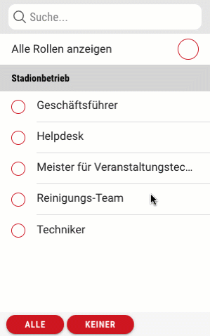

# Neuigkeiten aus Release 2020-05

* Desktop Client ab Version 1.X.X
* Mobile Client ab Version 1.11.0

## Neue Features
- **Funktionsbereichsübergreifende Checklisten-Berechtigungen**  
Hört sich kompliziert an, ist es aber gar nicht.  
Bisher konnten Checklisten-Berechtigungen nur an Rollen des aktuellen Funktionsbereichs vergeben werden. Als Workaround mussten Rollen bis dato teilweise doppelt angelegt werden. Mit diesem Update ist es nun möglich, auch Rollen anderen Funktionsbereiche freigebend, abarbeitend oder lesend in Checklisten zu integrieren. 
  

- **Prüfbericht mit neuem Layout**  
Der Prüfbericht war zwar strukturiert, aber schwer zu lesen. Wir haben ihn dahingehend überarbeitet, dass jetzt insbesondere auf Ebene der Checklisten und Aufgaben alle wesentlichen Informationen und Abarbeitungsergebnisse gut ersichtlich sind. Dazugehören auch die neuen Aufgaben-Bemerkungen und Bilder.  

- **Gesendete Trouble-Tickets**  
Bisher sind die Trouble-Tickets einfach per Mail an die hinterlegten Adressaten rausgegangen, um sie extern weiter bearbeiten zu können. Jetzt sind sie für den BEnutzer als gesendete Trouble-Tickets sichtbar. Das ist ein weiterer Schritt in Richtung Incident-Management, wenn gleich damit noch nicht viel gemacht werden kann. Aber bald...  

- **Dokument-Berechtigungen**  
Als Funktionsbereichsadmin konnte man bisher Dokumente hochladen, damit sie in der App bereitgestellt werden. Dummerweise konnte man aus dieser Möglichkeit heraus auch Dokumente im Backend sehen, die eigentlich nicht für einen bestimmt waren. Das haben wir geändert. Man sieht nur noch Dokumente die öffentlich sind oder wenn man eine explizite Leseberechtigung hat. 

# Bugfixes & allgemeine Verbesserungen

- **Fehlermeldung bei Erstanmeldung**  
Wenn man sich initial angemeldet hat, erschien bereits vor der Mandantenauswahl eine irritierende Fehlermeldung. Die war zwar nicht dramatisch, aber das ist nicht die feine Art. So begrüßt man seine Gäste nicht und daher haben wir dies korrigiert.

- **Aktualisierung bei Checklisten-Berechtigungen**  
Hat man die Checklisten-Berechtigungen geändert (Freigeben, Abarbeiten, Lesen), hat das System es zwar verstanden und gespeichert, es aber nicht direkt angezeigt. Jetzt sollte die Rückmeldung vom System passen.

- **Telefon-Icon beim Veranstaltungsleiter**  
Das Icon soll eigentlich symbolisieren, dass eine anrufbare Rufnummer beim Veranstaltungsleiter hinterlegt ist, so wie im Dienstplan auch. Allerdings war das Icon immer sichtbar und hat den Anwender damit in die Irre geführt. Das wollen wir natürlich nicht.

- **Anzeigeoptimierungen**  
Nur Kleinigkeiten, aber Aufgabenverlauf in der App und die Aufgaben-Bearbeitung in der Checklistenverarbeitung im Backend sind verbessert worden. Zum Beispiel werden mehrzeilige Aufgabenbeschreibungen nicht mehr abgeschnitten. Und die Erinnerungszeitpunkte der Aufgaben werden im Backend jetzt besser dargestellt.

- **Aufgabebnsortierung in der App**  
Seit dem letzten Update ist es möglich, die Sortierung der Aufgaben in einer Checkliste nach eigenem Gusto vorzugeben. Wenn man sich schon die Mühe macht, sollte das System dies auch in der App berücksichtigen. Das tut es jetzt.

- **Scrollverhalten in langen Checklisten**  
Wenn man als Abarbeiter schon die ehrenvolle Aufgabe hat eine Vielzahl an Checks durchführen zu müssen, dann sollte das möglichst smart funktionieren. Wir hatten noch ein Problem, dass die Checkliste immer wieder an den Anfang gesprungen ist, obwohl man bereits im unteren Teil angekommen war. Das war nervig und sollte jetzt besser funktionieren.

- **Mitteilungseinstellungen verbssert**  
Auch ein relativ neues Feature aus dem letzten Release, leider mit einem irritierenden Verhalten: Hat man innerhalb eines Funktionsbereiches neue Rollen definiert, wurden in Bezug der Mitteilungseinstellungen noch die Werte der Vorgängerrolle angezeigt. Da konnte man schnell durcheinander kommen. Jetzt gelten die angezeigten Einstellungen auch für die aktuelle Rolle - so wie man es erwarten darf.

