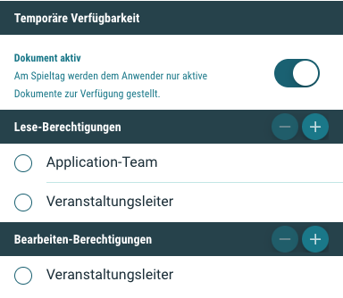

# Neuigkeiten aus Release 2020-06 | 2

* Desktop Client ab Version 1.19.8
* Mobile Client ab Version 1.13.9

## Neue Features
- **Bezeichnung "Einlass" und "Beginn" individualisierbar**  
Wann eine Veranstaltung beginnt, und wann der Einlass gewährt wird, sind elementare Referenzpunkte für die Steuerung aller Fälligkeiten und Erinnerungsfunktionen. Das bleibt auch so. Aber die Bezeichnungen "Einlass" und "Beginn" sind jetzt individualisierbar und können in den Mandanteneinstellungen konfiguriert werden. So kann beispielsweise aus "Beginn" - "Anpfiff" oder "Start" werden und aus "Einlass" - "Öffnung Arena-Innenraum".

- **Dokument Berechtigungen**  
Um den Alltagsanforderungen noch detaillierter entsprechen zu können, haben wir die explizite "Bearbeiten-Berechtigung" für Dokumente eingeführt. Damit können die bearbeitenden Anwender aus dem Back-Office noch einmal von den konsumierenden (also lesenden) Anwendern in der App unterschieden werden. 
  
  

## Allgemeine Verbesserungen & Bugfixes

- **Sortierung der Checklisten und Aufgaben**  
Checklisten und Aufgaben können via Drag & Drop beliebig sortiert werden. Wurde eine Checkliste oder eine Aufgabe nachträglich aktualisiert (z.B: Berechtigungen angepasst), dann wurde sie in der Liste immer oben neu einsortiert und die ursprünglich gewählte Position ging verloren.

- **Checklisten Berechtigungen beim Kopieren einer Veranstaltung**  
Beim Kopieren einer Veranstaltung konnte es vorkommen, dass Checklisten-Berechtigungen nicht übernommen wurden. Jetzt funktioniert es.

- **Checklisten verschieben Funktion verbessert**  
Bisher konnten Checklisten nur in andere Funktionsbereiche verschoben werden, wenn dort mindestens eine Checkliste als "Anker" vorhanden war. Jetzt geht es auch einfach

- **Styling**  
Beim Wechsel zwischen verschiedenen Mandanten konnte es passierten, dass die Styling-Informationen nicht mehr geladen und damit der Theme nicht gewechselt werden konnten. Das sollte jetzt klappen.
Das Problem betraf nur Anwender, die in mehreren Mandanten freigeschaltet sind. Und auch in Premium Paketen wird wieder alles richtig dargestellt, selbst wenn zuvor in einen anderen Mandanten gewechselt wurde und ein Logout erfolgt.

