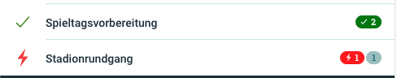
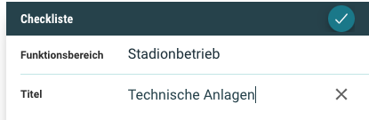
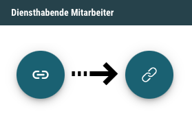

# Neuigkeiten aus Release 2020-07

* Desktop Client ab Version 1.XX.X
* Mobile Client ab Version 1.XX.X

## Allgemeine Verbesserungen & Bugfixes

- **Anzeige der Stati für Rot/Grün-Schwäche optimiert**  
In der App wird durch rot und grün hinterlegte Counter angezeigt, wieviele Aufgaben einer Checkliste als Nich-OK bzw. OK gebucht wurden. Menschen mit Rot/Grün-Schwäche können diese Counter nicht unterscheiden. Wir haben diese Counter deshalb mit entsprechenden Icons versehen

  

- **Anzeige des Funktionsbereichs bei neuen Checklisten**  
Beim Anlegen einer neuen Checkliste wurde bisher nicht der gewählte Funktionsbreich angezeigt. Um eine bessere Orientierung zu bieten, wird der Funktionsbreich nun über dem Titel der Checkliste angezeigt.

  

- **Mitarbeiter einteilen - Icon ausgetauscht**  
Wir haben festgestellt, dass die Funktion des Buttons zum Einteilen (oder auch Verknüpfen) der Mitarbeiter im Dienstplan aufgrund des Icons von einigen Anwendern nicht erkannt wurde. Das Icon wurde eher als Station anstatt als Link Symbol wahrgenommen. Mit dem neuen Icon sollte das etwas deutlicher sein.

  

- **Anlegen von Checklisten als Funktionsbereichs-Admin**  
Es gab das Problem, dass Funktionsbreichs-Admins in manchen Fällen keine Checklisten aus ihrem eigenen FB zu einer Veranstaltung hinzufügen konnten. Dieses Problem wurde behoben.