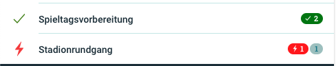

# Neuigkeiten aus Release 2020-07

* Desktop Client ab Version 1.19.10
* Mobile Client ab Version 1.13.9

## Neue Features
- **Prüfbericht für Funktionsbereiche und Checklisten**  
Bisher wurden bei den Prüfberichten für einzelne Funktionsbereiche oder Checklisten auch nicht relevante Bereiche mit ausgegeben. Dies wurde angepasst und die Prüfberichte enthalten jetzt nur noch die jeweils gewünschten Daten.

  

- **Gruppierung der Hauptmenüpunkte im Desktop Client**  
In Vorbereitung auf kommende neue Funktionen haben wir das Seitenmenü im Desktop Client gruppiert. Konkret wurden die beiden Gruppen "Verwaltung" und "Operativ" eingeführt. Im operativen Bereich befindet sich aktuell nur die Funkprotokollierung, sofern die Anwender für diesen Bereich berechtigt sind. Mit dem nächsten Release werden dort aber auch die Aufgaben-Checks am PC möglich sein.

  

## Allgemeine Verbesserungen & Bugfixes

- **Aufgaben-Status für Rot-Grün-Schwäche optimiert**  
In der App wurden die rot und grün hinterlegten Counter zur Anzeige der Bearbeitungsstände (Nicht-OK und OK) durch entsprechende Icons ergänzt, um die Unterscheidbarkeit für Menschen mit einer Rot-Grün-Schwäche gewährleisten zu können.

  

- **Anzeige des Funktionsbereiches bei neuen Checklisten**  
Beim Anlegen einer neuen Checkliste wird nun der ausgewählte Funktionsbereich mit angezeigt, um dem Anwender eine bessere Orientierung zu bieten.

  

- **Mitarbeiter einteilen - Icon ausgetauscht**  
Wir haben festgestellt, dass die Funktion des Buttons zum Einteilen (oder auch Verknüpfen) der Mitarbeiter im Dienstplan aufgrund des Icons von einigen Anwendern nicht erkannt wurde. Das Icon wurde eher als Stadion anstatt als Link-Symbol wahrgenommen. Mit dem neuen Icon sollte das deutlicher sein.

  

- **Anlegen von Checklisten als Funktionsbereichs-Admin**  
Es gab den Fall, dass einige Checklisten der Funktionsbereichs-Admins beim planen einer Veranstaltung nicht hinzufügt werden konnten. Das sollte jetzt wieder wie gewohnt möglich sein.

