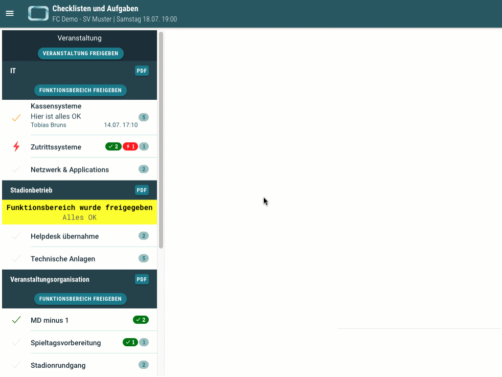
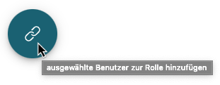

# Neuigkeiten aus Release 2020-07 | 2

* Desktop Client ab Version 1.XX.XX
* Mobile Client ab Version 1.XX.XX

## Neue Features

- **Aufgaben-Checks am PC**  
Wie im vorherigen Release schon angekündigt, findet man jetzt im neuen operativen Bereich des Seitenmenüs den Punkt "Checklisten und Aufgaben" und damit die Möglichkeit, Checklisten auch am Desktop PC abzuarbeiten und einzusehen. 

  

## Allgemeine Verbesserungen & Bugfixes

- **Buttons mit Tooltips**  
Im Desktop Client wurden alle Buttons mit Tooltips versehen. Einfach kurz mit der Maus auf einen Button zeigen und ein kurzer Erklärungstext wird eingeblendet.

  

- **Doppelte Mitteilungen**  
In manchen bestimmten Konstellationen ist es vorgekommen, dass Mitteilungen mehrfach an einen Empfänger geschickt wurden. Das wurde nun behoben.

- **Automatische Aktualisierung der Inhalte**  
Normalerweise werden (die meisten) Inhalte in den Apps (Desktop, Mobile) bei Änderung automatisch aktualisiert. An einigen Stellen haben wir diese Funktion weiter optimiert.