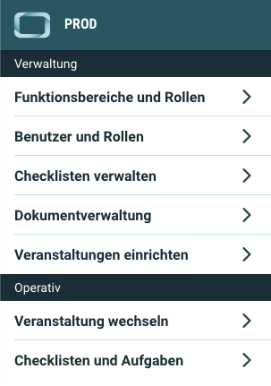

# Neuigkeiten aus Release 2020-07 | 2

* Desktop Client ab Version 1.19.11
* Mobile Client ab Version 1.13.10

## Neue Features

- **Aufgaben-Checks am PC**  
Oft nachgefragt - nun ist es möglich: Die Abarbeitung der Checklisten im Backend. Mitarbeiter die die Veranstaltung am festen Arbeitsplatz begleiten, können von nun an auch den Bearbeitungsstatus der Checklisten oder die Aufgaben-Checks selbst am PC ausführen. Wie im vorherigen Release schon angekündigt, findet man jetzt im neuen operativen Bereich des Seitenmenüs den Punkt "Checklisten und Aufgaben" und damit die Möglichkeit, Checklisten auch am Desktop PC abzuarbeiten und einzusehen. 
  
  

  Das Handling ist denkbar einfach. Es sind genau die gleichen Elemente, wie Sie sie aus der App bereits kennen. Mit dem Vorteil, dass auf Grund des größeren Bildschirms alles auf einen Blick zu erkennen ist.

  

## Allgemeine Verbesserungen & Bugfixes

- **Buttons mit Tooltips**  
Nicht jede Funktion erklärt sich auf Anhieb von selbst. Daher haben wir im Desktop Client alle Buttons mit Tooltips versehen. Einfach kurz mit der Maus auf einen Button zeigen und ein kurzer Erklärungstext wird eingeblendet.

  

- **Doppelte Mitteilungen**  
In bestimmten Konstellationen konnte es vorgekommen, dass Mitteilungen einzelne Empfänger mehrfach erreicht haben. Das wurde nun behoben.

- **Automatische Aktualisierung der Inhalte**  
Die Inhalte in den Apps (Desktop und Mobil) werden bei Änderungen automatisch aktualisiert. An einigen Stellen haben wir diese Funktion weiter optimiert.