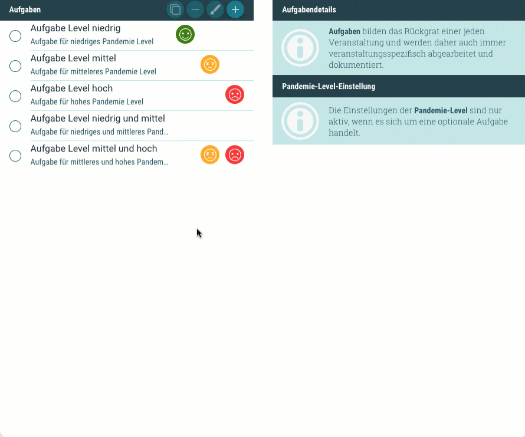
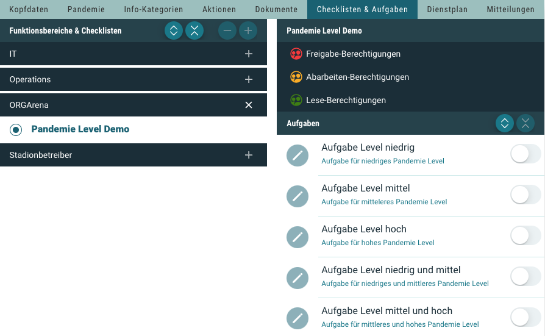
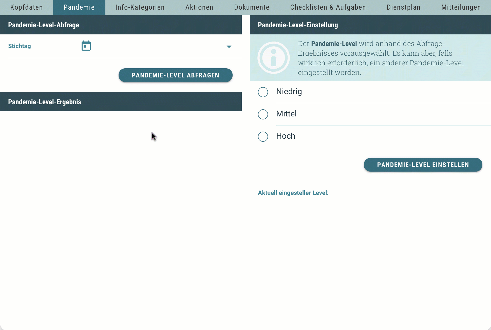
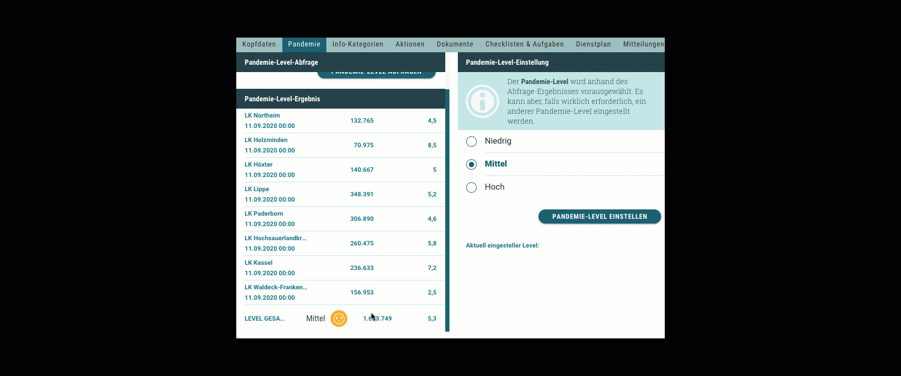

# Neuigkeiten aus Release 2020-09

* Desktop Client ab Version 1.21.1
* Mobile Client ab Version 1.13.10

## Neue Features

- **Pandemie-Level**  
In diesem Release haben wir eine Funktion eingebaut die es ermöglicht, die sogenannten Pandemie-Level der angrenzenden Landkreise abzufragen und damit verschiedene, auf diese Level angepasste Aufgaben, zentral für eine Veranstaltung zu aktivieren. 

    Zuerst wird den Aufgaben ein (oder auch mehrere) Pandemie-Level zugewiesen:
  
  
  
    Diese Aufgaben sind zuerst alle deaktiviert:
    
  
  
    Danach kann das Pandemie-Level (für einen bestimmten Stichtag) abgefragt und für die Veranstaltung festgelegt werden:
    
     
  
    Durch diese Abfrage wird ein Pandemie-Level vorgeschlagen. Durch das Einstellen eines Levels werden die im vorherigen Schritt genannten Aufgaben entsprechend aktiviert:

  
  
    Es kann bei Bedarf aber auch ein anderes Level eingestellt werden. Die Aufgaben werden dann entsprechend aktiviert:
  
     
