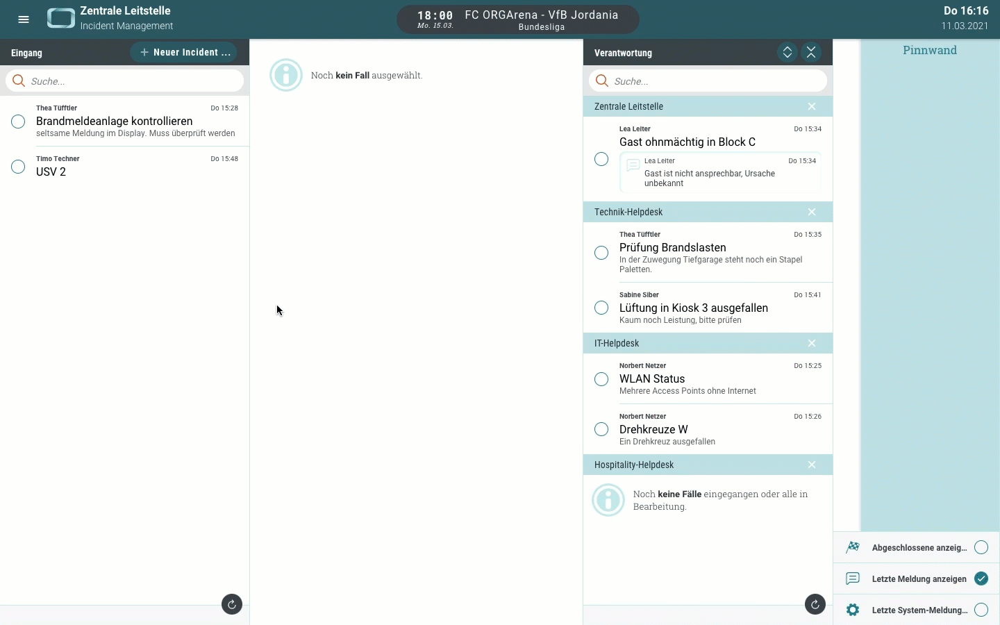
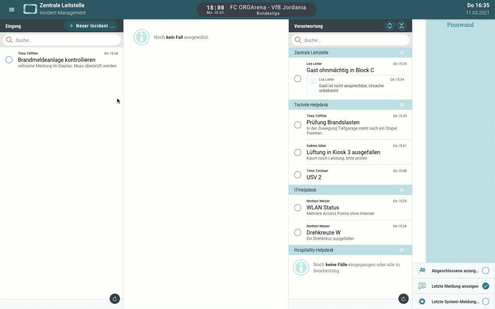
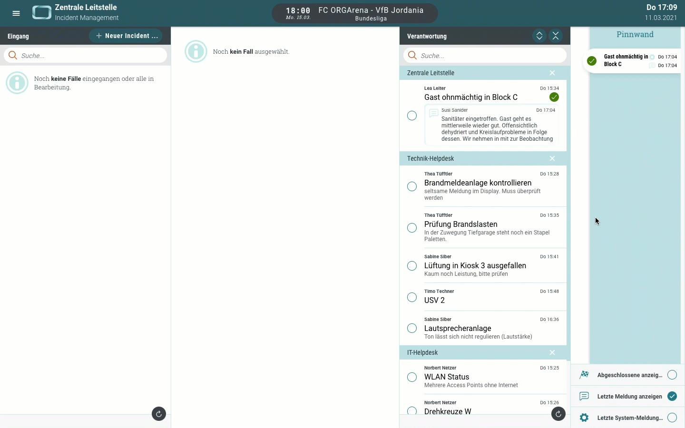
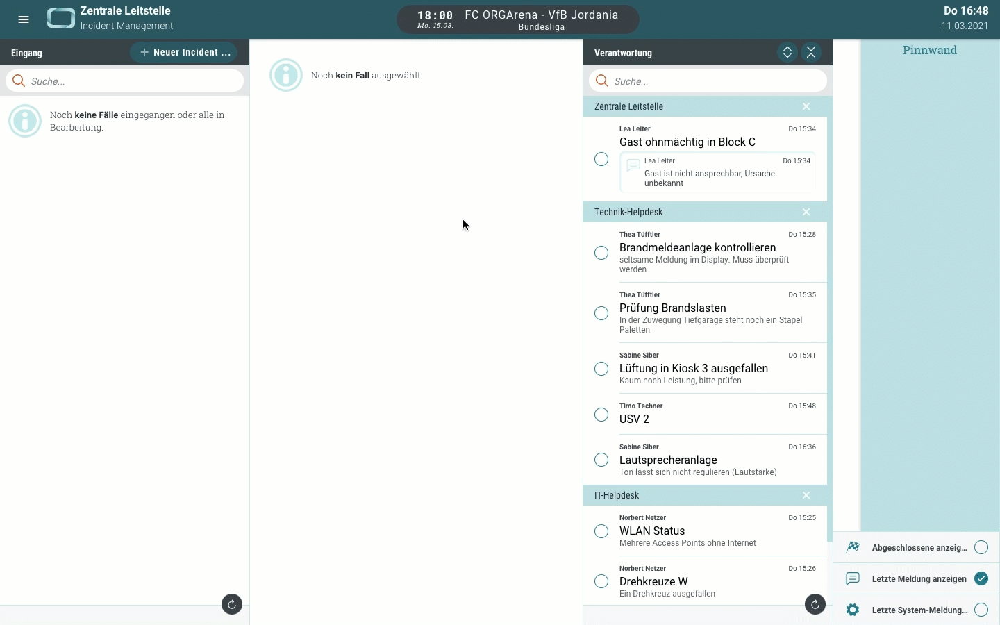
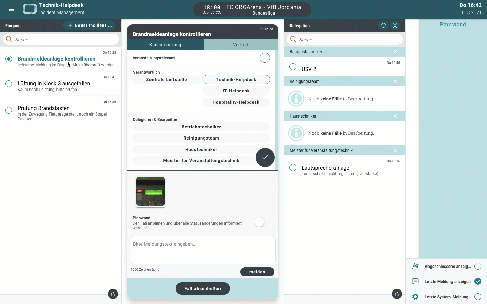
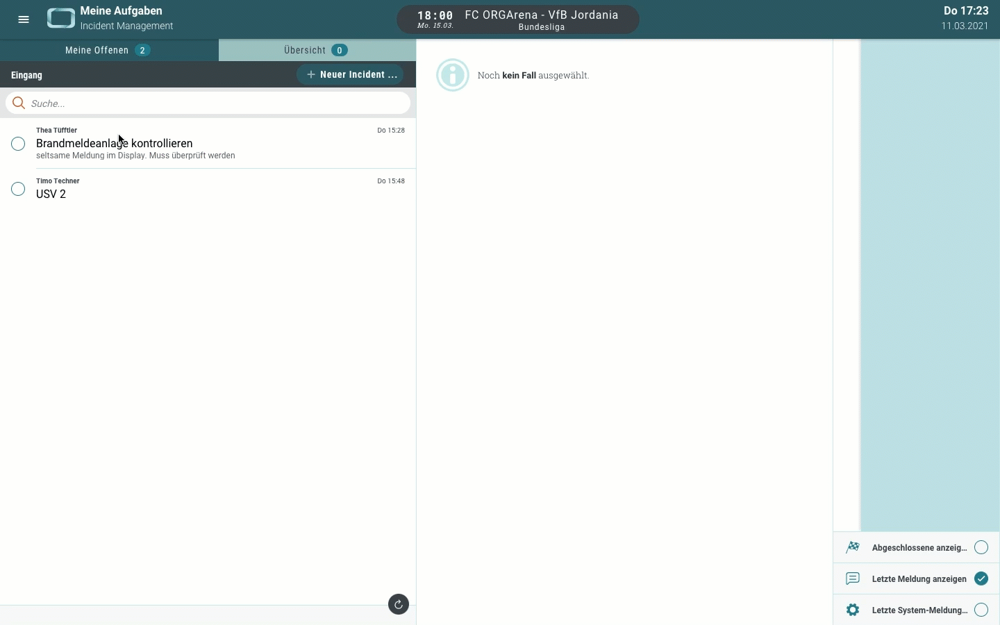
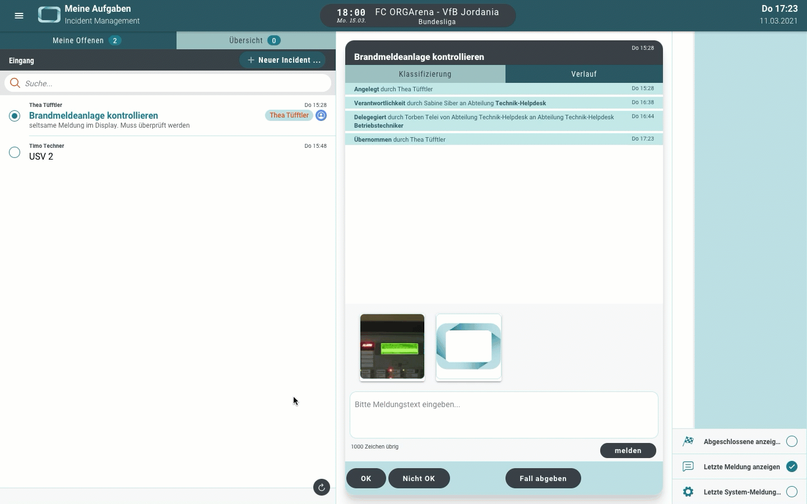
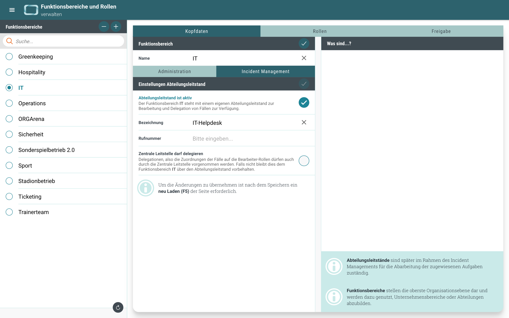
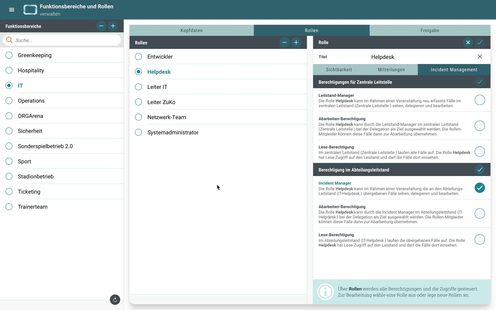

# Neuigkeiten aus Release 2021-03

* Desktop Client ab Version 1.30.0

## Neues Modul - Incident Management

Bei diesem Update dreht sich alles um das Thema Incident Management. Wir haben ganz neue Oberflächen und Bereiche geschaffen, und dabei auf die bewährte Funktionsbereiche & Rollen Struktur aufgebaut. Damit ermöglichen wir individuelle Einsatzmöglichkeiten im Rahmen einer einfach strukturierten Management-Hierarchie. Wir sind schon jetzt auf eure Umsetzungsideen gespannt. Folgendes haben wir mit dieser ersten Version des Incident Management für euch mit im Gepäck:

* Den "Zentralen Leitstand"
* Beliebig viele "Abteilungsleitstände"
* Den "Meine Aufgaben" Bereich

Hier ein paar Eindrücke, wie das Thema in der neuen Version des ORGA App DesktopClients umgesetzt wurde.

 
 

## Zentraler Leitstand
Die Idee ist denkbar einfach: Alle Fälle (oder auch Incidents) landen zunächst im Eingang des Zentralen Leitstandes. Damit wird sichergestellt, dass keine parallelen (unkontrollierten) Kommunikationswege entstehen. In der Zentrale werden die Fälle an die jeweiligen Abteilungsleitstände dispatcht. Die Verantwortung für die Abarbeitung wird also an den Fachbereich übertragen.

- **Verantwortung übergeben** 
Alle gemeldeten Fälle werden von dem Incident-Manager dispatcht. Damit wird die Verantwortung an die jeweilige Fachgruppe übergeben. Von der Zentrale aus hat man stets alle Fälle im Überblick.
 

- **Neue Fälle erstellen** 
Es besteht natürlich auch die Möglichkeit, neue Fälle direkt über die Leitstände zu erfassen. 
 

- **Fälle abschließen** 
Die Bearbeitung der Fälle erfolgt in den Teams. Dort wird auch der Status auf OK gesetzt, sobald ein Fall erledigt ist. Aber über den Abschluss eines Fall, entscheidet immer die Leitstelle. Schließlich will man die Themen auch für sich abhaken können.
 

- **Pinnwand** 
Gerade die wichtigen Fälle müssen immer im Zugriff sein. Daher haben wir eine Pinnwand bereitgestellt, die genau diesen Schnellzugriff ermöglicht und stets den aktuellen Bearbeitungsstand der Fälle anzeigt.
 

 
 

## Abteilungsleitstand
Dann hat jede Abteilung (sofern es operativ Sinn ergibt oder so gelebt werden soll) ihren eigenen Leitstand. Die dispatchten Fälle landen demnach im Eingang der sogenannten Abteilungsleitstände. Von hier werden sie weiter an das Team zur Abarbeitung delegiert.

- **Fälle delegieren** 
Wer aus dem Team soll den Fall den übernehmen? An dieser Stelle sind die Rollen gemeint...

 
 

## Meine Aufgaben
Die dritte Ebene bezieht sich dann auf die Abarbeitung der Fälle, schließlich wollen wir die Themen am Ende als erledigt abhaken können. Dazu übernimmt ein (im Dienst befindlicher) Mitarbeiter den Fall aus dem "Team-Pool" zur Bearbeitung und schreibt die Bearbeitung mit Einzelmeldungen fort. Am Ende entscheidet er (wie bei den Aufgaben einer Checkliste) "ist OK" oder "ist nicht OK". Dies wird im Abteilungsleitstand angezeigt und der Fall wird abgeschlossen.

- **Fälle übernehmen** 
Ein Fall wird immer von einem Mitarbeiter übernommen. Natürlich können am Ende auch mehrere Mitarbeiter aus unterschiedlichen Fachabteilungen beteiligt gewesen sein. Aber zu jeden Zeitpunkt ist klar, wer gerade die Dinge übernommen hat.
 

- **Fälle bearbeiten** 
Mit Einzelmeldungen kann jeder Mitarbeiter den Bearbeitungsstand fortschreiben. Am Ende sollte er analog zur Checklistenbearbeitung mitteilen, ob der Fall aus seiner Sicht Ok oder eben nicht Ok ist.
 

 
 

## Konfiguration
Wer legt denn jetzt fest, welche Abteilung, welche Rolle, welcher Mitarbeiter im Rahmen des Incident Managements berechtigt und befähigt wird, Fälle zu erfassen, zu delegieren oder den Bearbeitungsstand einzusehen. Genau - wie immer ihr selbst.

- **Einstellungen Funktionsbereich**  
In den Kopfdaten der Funktionsbereiche könnt ihr entscheiden, ob ein Funktionsbereich eine eigene Abteilung im Sinne des Incident Managements anbietet. Und für den Fall dass dem so ist, ob die Zentrale über die Delegation der Fälle ans Team entscheiden darf oder kann. Und wenn ihr mögt, kann die Bezeichnung gezielt gesetzt werden - in Standard ist es einfach der Name des Funktionsbereichs.
 

- **Einstellungen Rollen**  
Ist die Frage nach den Abteilungsleitständen geklärt, könnt ihr für jede Rolle einzeln entscheiden, was sie darf und was nicht. Natürlich bezieht sich alles immer auch auf den Dienstplan. Wer kein Dienst hat, darf nichts sehen oder tun.
 

## Allgemeine Verbesserungen & Bugfixes

Haben wir auch immer an Board, aber es ist schon genug gesagt...