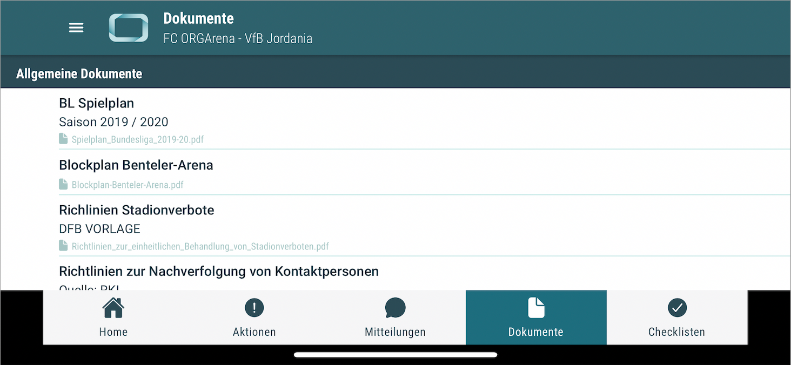
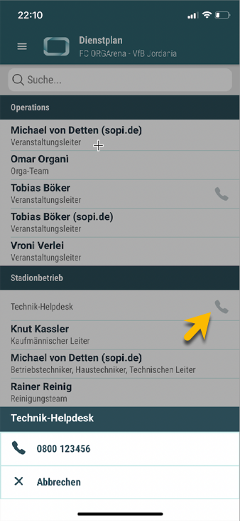
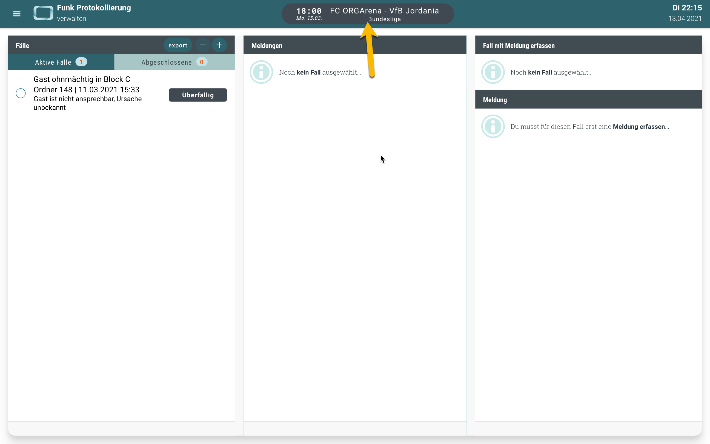

# Neuigkeiten aus Release 2021-04

Dieses Release ist in erster Linie technisch bedingt gewesen. Neue Richtlinien (insbesondere bei Apple) haben uns zu technischen Umbaumaßnahmen gezwungen. Die entsprechenden Neuerungen erfordern eine Neuinstallation, bzw. ein Store-Update, da der App-Rahmen gewechsel. Nichts desto trotz wollten wir auch einige neue Features bereitstellen.

* Desktop Client ab Version 1.31.5
* Mobile Client ab Version 1.16.5 (Store Update erforderlich)

 
 

## Landscape Modus - ORGA App im Querformat

Viele von euch haben drauf gewartet: Die ORGA App im Querformat. Insbesondere kann die App damit komfortabler am Tablet genutzt werden. Gerade mit angeschlossener Tastatur bringt das hoffentlich die ersehnte Erleichterung 

 
 

## Incident-Management - Abteilungsrufnummern im Dienstplan
Bereits mit dem letzten Update haben wir das Incident Management vorgestellt. Hier haben wir layout-technisch noch ein wenig nachgebessert. Als neue Funktion werden jetzt die Rufnummern aus den Funktionsbereichseinstellungen (Abteilungsleitstände) direkt im Dienstplan angezeigt.

 
 

## Veranstaltungswechsel im Funkprotokoll
Analog zum Incident Management wird die Veranstaltung auch im Funkprotokoll jetzt über den zentralen Auswahldialog gesteuert. Dies schafft mehr Platz für's Wesentliche und ein einheitliches Bedienkonzept.

 
 

## Allgemeine Verbesserungen & Bugfixes

- **Konsistentes Farbschema** 
Die Aufgaben Status (insbesondere "OK" und "nicht OK") werden jetzt einheitlich in den Checklisten und im Incident Managemet verwendet.

- **Pandemie-Icons ausgerichtet** 
Die Icons stehen jetzt rechtsbündig untereinander, so wie man es erwarten würde. So ist klar erkennbar, welche Aufgaben bei welchem Pandemie-Level aktiv sind.

- **Diverse Optimierungen** 
Das Senden von Mitteilungen funktioniert jetzt (noch) zuverlässiger, diverse Styleoptimierungen für ein konsistenteres Layout wurden angewendet, optionale Aufgaben werden in der Checklistenübersicht nun korrekt gezählt.