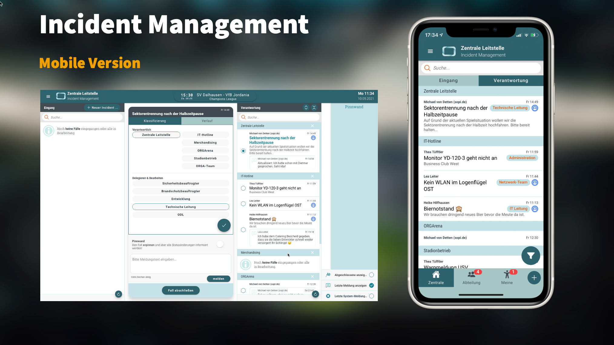
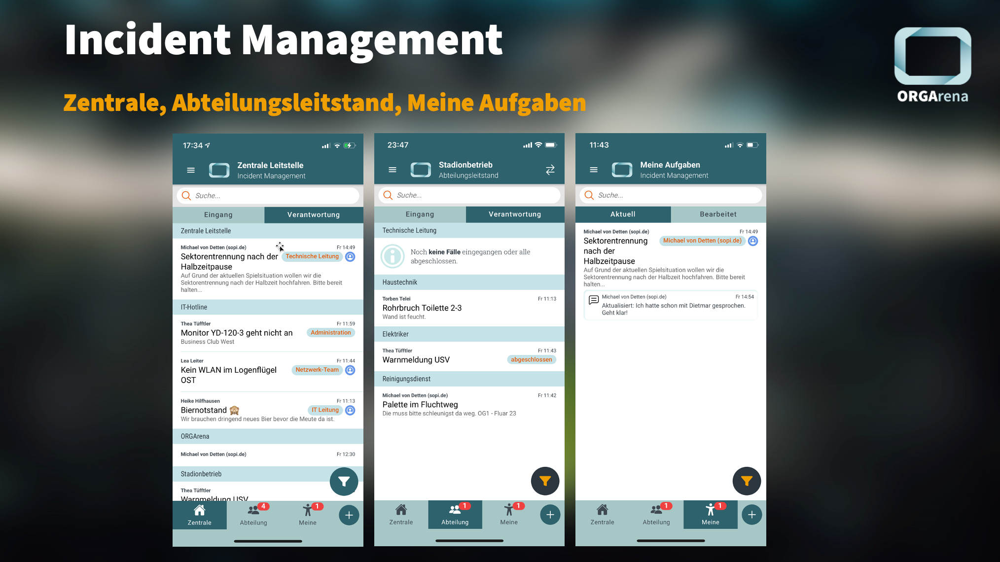

# Neuigkeiten aus Release 2021-05

Mit diesem Release komplettieren wir unser Incident Management. Alle Funktionen, die bereits im DesktopClient bereitgestellt wurden, finden jetzt auch Einzug in den MobileClient, also die ORGA App für eure Smartphones.

* Desktop Client ab Version 1.32.0
* Mobile Client ab Version 1.17.0 (per InAppUpdate)

 

 

## Das mobile Incident Management
Genau wie im DesktopClient landen alle Fälle (oder auch Incidents) zunächst im Eingang des Zentralen Leitstandes. Damit wird sichergestellt, dass keine parallelen (unkontrollierten) Kommunikationswege entstehen. Die Incident-Manager (über das Rechtemanagement der ORGA App konfigurierbar) verteilen die Fälle an die jeweiligen Fachabteilungen (Abteilungsleitstände).

Die Vorteile der mobilen Version liegen auf (oder besser in) der Hand: Das Smartphone ist immer dabei und somit auch die Gewissheit, keinen Fall zu verpassen. Zusätzlich sind die Fälle per Handy-Kamera schnell mit Fotos dokumentiert.

Wir haben die unterschiedlichen Bereiche des Incident Managements analog zum Veranstaltungsbereich in einer übersichtlichen Reiter-Ansicht zusammengefasst.

- **Zentrale Leitstelle** 
Hier landen zunächst alle Fälle im *Eingang*. Im ersten Schritt wird die Verantwortung für die Abarbeitung an den Fachbereich übertragen. Die bereits zugeordneten Fälle tauchen dann unter *Verantwortung* auf.

- **Abteilungsleitstand** 
Auf der fachlichen Ebene werden die von der Zentrale weitergeleiteten Fälle wiederum zunächst im *Eingang* angezeigt und von hier weiter an das Team zur Abarbeitung delegiert (siehe *Verantwortung*).

- **Meine Aufgaben** 
Unter dem Reiter "Meine" laufen alle Fälle auf, die aus Anwendersicht dem eigenen Team zur Abarbeitung übertragen wurden. Einer aus dem Team übernimmt dann den Fall aus dem "Team-Pool" zur Bearbeitung und entscheidet: "ist OK" oder "ist nicht OK".

 
 

## Externe Benutzer
Mitarbeiter externe Dienstleister wie Monteure, Order, Caterer, etc. haben in der Regel kein eigenes Benutzerkonto im Club-Mandanten. Dennoch möchte man ihnen Checklisten und Aufgaben zuweisen können. Wichtig dabei, insbesondere aus Datenschutzgründen: Eine sichere Authentifizierung und die administrative Entscheidungshoheit der Club-IT.

Jetzt können externe Benutzer in das Club-AAD als Gast-User eingebunden werden und sich so im MobileClient der ORGA App authentifizieren. Der Benutzer muss dem Zugriff der App auf sein Benutzerkonto zustimmen. 

Welche Inhalte für externe Benutzer sichtbar sind, wird analog zu den internen Benutzern über die Berechtigungsvergabe innerhalt der ORGA App gesteuert.  

 
 

## Neues Funkprotokoll-Layout
Das Funkprotokoll erstrahlt im neuen Gewand. Wir haben einige Layout-Elemente aus dem neuen Incident Management auch im Funkprotokoll verbaut, sodass das Look & Feel für die Anwender konsistent und benutzerfreundlich ist. Schaut einfach mal rein...

 
 

## Allgemeine Verbesserungen & Bugfixes

- **Optimierung der Layouts und Darstellungen für Style- und Premium-Kunden** 
Im Zuge der neuen Komponenten aus dem Incident Management haben wir weitere Angleichungen vorgenommen, um die Wartbarkeit des wachsenden Systems sicherstellen zu können.

- **Kleinere Fehlerbehebungen und Performanceoptimierungen** 
Die gibt es immer, fallen im normalen Alltag aber selten auf...