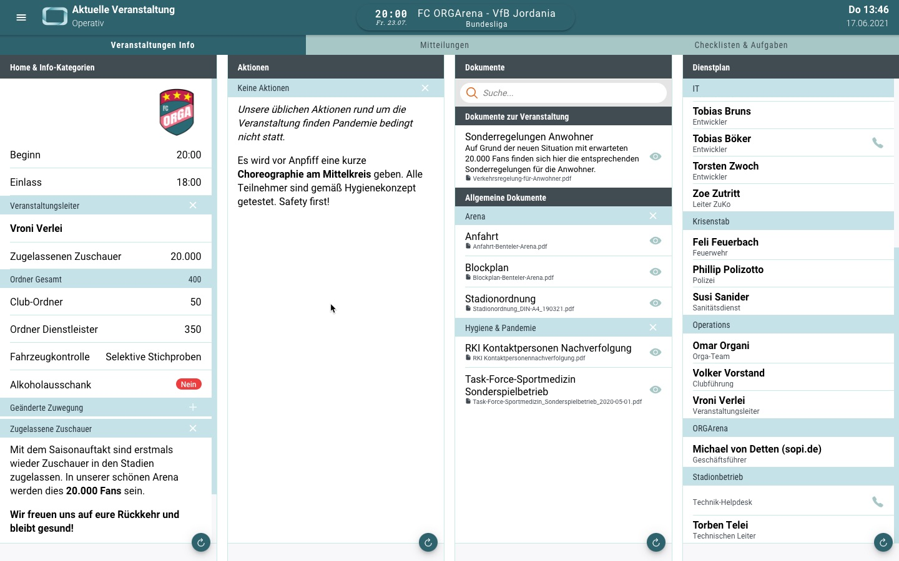
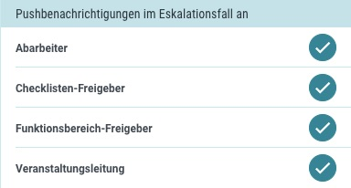
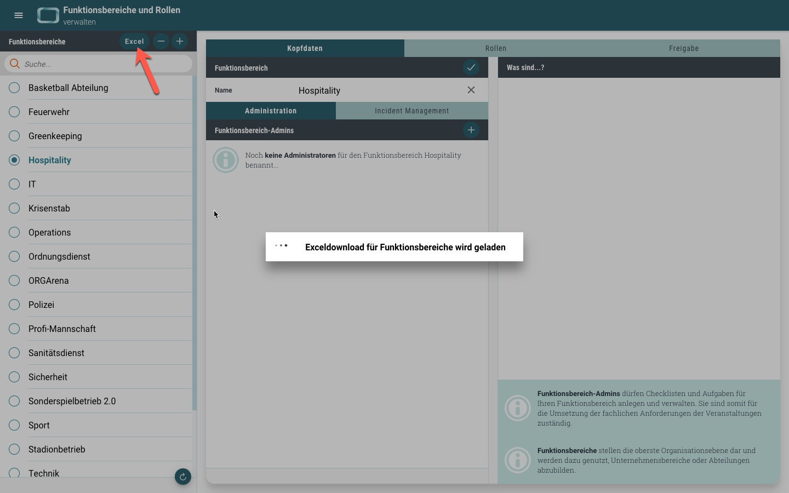
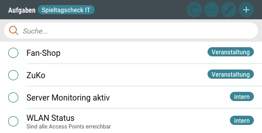
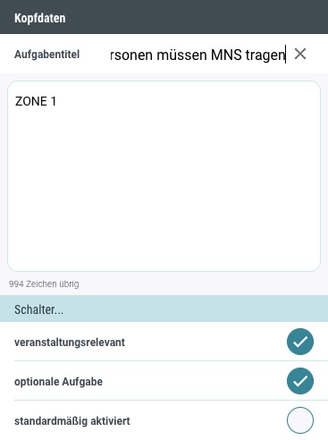
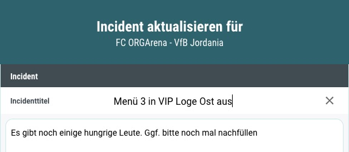

# Neuigkeiten aus Release 2021-06

Schon lange wartet ihr darauf die App-Inhalte auch im DesktopClient nutzen zu können. Das haben wir euch nun mit einer übersichtlichen Seite bereitgestellt.

Zusätzlich sind weitere Optimierungen im Gepäck, die euch das ORGA App Leben erleichtern...

* Desktop Client ab Version 1.33.7
* Mobile Client ab Version 1.18.1 (Store Update erforderlich)

 

## Die "Desktop-Version"
In den Anfängen der ORGA App wurde der DektopClient als administratives Backend konzipiert und genutzt. Stetige Funktionserweiterungen und Optimierungen haben ihn längst zum unverzichtbaren Tool im Rahmen der Veranstaltungsorganisation werden lassen. 

Aber ein Teil fehlte bislang: Wichtige Inhalte wie __Veranstaltungsdaten__, __Info-Kategorien__, __Aktionen__, __Dokumente__, __Dienstpläne__ und __Mitteilungen__ standen nur den administrativ tätigen Benutzern zur Verfügung. 
Ab jetzt gibt es all diese Informationen auch im DesktopClient!

_Hinweis: Der zuvor eigenständige Checklisten & Aufgaben Teil aus dem operativen Bereich wurde hier vollständig integreiert. So müssen die Anwender nicht zwischen unterschiedlichen Seiten hin nd her wechseln._

 
 

## Neuerungen in der ORGA App
Obwohl wir uns mit diesem Release auf den DesktopClient konzentriert haben, gibt es dennoch einigen Neuerungen für die App und an anderen Stellen.
 

- **Eskalatioen an VL** 
Der Veranstaltungsleiter wurde bisher nur über den Bearbeitungsstand von Aufgaben informiert, wenn diese _nicht ok_ gemeldet wurden. Jetzt ist darüber hinaus für jede Aufgabe eine Eskalation an den Veranstaltungsleiter einstellbar. 

- **ORGA Struktur als Ecxel download** 
Backend Admins haben zwar Einsicht in alle Bereiche, aber für manche Aufgaben kann es hilfreich sein, die ORGA App Strukturen übersichtlich in einer Excel-Tabelle auszuwerten. Und genau dafür haben wir eine neue Excel-Auswertung für Backend Admins bereitgestellt. 

- **Veranstaltungsrelevante und interne Aufgaben** 
Nichts Neues, aber eine bessere Darstellung der Aufgabenkonfiguration zeigen jetzt auf den ersten Blick, welche Aufgaben einer Checkliste veranstaltungsrelevant sind. 

- **Default-Value für optionale Aufgaben** 
Aufgaben konnten schon lange als optional gekennzeichnet werden, aber sie wurden immer automatisch deaktiviert in Kontext einer Veranstaltung. Das entsprach oftmals auch der Intention (beispielsweise _Schnee räumen_ eher selten), aber manchmal auch nicht. Genau deswegen können optionale Aufgaben jetzt individuell _standardmäßig aktiviert ja oder nein_ vorbelegt werden. Macht Sinn, oder? 

- **Incident Counter** 
Zur besseren Übersicht haben wir an unterschiedlichen Stellen das Incident Management mit Countern ausgestattet, sodass stehts die Anzahl (insbesondere der offenen Fälle) überblickt werden kann.

- **Bearbeitungsfunktion** 
Titel und BEschreibung der Incidents waren bis dato fix. Aber natürlich will man auch mal kleine Änderungen vornehmen oder einfach nur einen Tippfehler korrigieren. Das geht jetzt.

- **Veranstaltung statt Spieltag** 
Wir haben jetzt alle spieltagsspezifischen Dokumentbeschriftungen in _Dokumente der Veranstaltung_ umbenannt. Es wird ja nicht immer gespielt...

 
 

## Allgemeine Verbesserungen & Bugfixes

- **Optimierung der Layouts und Darstellungen für Style- und Premium-Kunden** 
Die Seiten im Incident Management wurden weiter getrimmt und viele der neuen Styling-Elemente wurden auf bereits etablierte Bereiche übertragen. Darüber hinaus wurden kleinere Design-Korrekturen vorgenommen. Auch die Kunden spezifischen Themes wurden noch einmal dezent überarbeitet.

- **Kleinere Fehlerbehebungen und Performanceoptimierungen** 
Diesmal haben wir die unter anderem Bilddaten verkleinert und den Login-Prozess optimiert, damit die App noch schneller startet. Auch die Navigation zwischen einzelnen Programmteilen wurde optimiert.