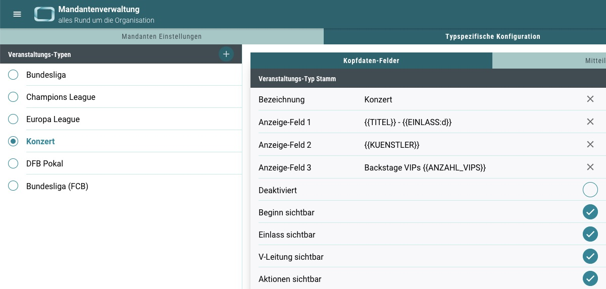
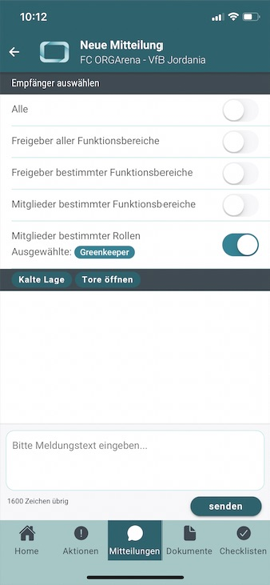
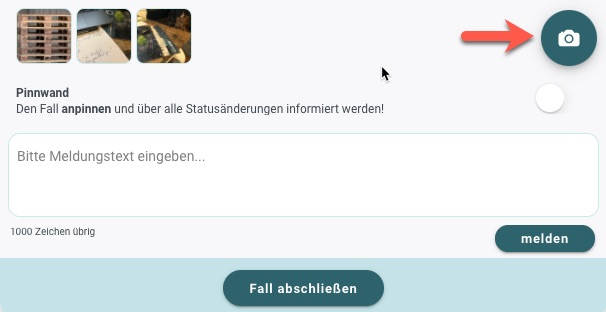

# Neuigkeiten aus Release 2021-07

Dieses Update steht ganz im Zeichen der kleinen und feinen Anpassungen, die sich insbesondere auf die Individualisierbarkeit des eigenen Mandanten beziehen.

* Desktop Client ab Version 1.35.0
* Mobile Client ab Version 1.19.5

 
 

## Neuerungen im ORGA App System
Viele der neuen Möglichkeiten stammen aus Kundenanforderungen, die sich auf einen erweiterten Nutzungskontext beziehen. Dabei wollen wir versuchen, immer mehr Konfigurationsmöglichkeiten in die Hände der Backend-Administratoren zu legen und damit den Self-Service Gedanken weiter vorantreiben.
 

- **Neue Typ-Konfigurationen** 
Die ORGA App wird immer kreativer und breiter in den Clubs und Organisationen eingesetzt. Das bedeutet neue Veranstaltungstypen werden angelegt. Hier gab es den Wunsch, einzelne Infos der Kopfdaten oder die beispielsweise Aktionen auszublenden, um die App-User nur auf die wesentlichen Inhalte blicken zu lassen. Daher kann nun eingestellt werden, ob Beginn, Einlass, Veranstaltungsleitung und Aktionen sichtbar sein sollen oder nicht.

- **Sichtbarkeit Trouble Tickets und Incident Management** 
Die ORGA App wird immer umfangreicher hinsichtlich ihrer Funktionen. Damit dies die Anwender nicht vor zu große Herausforderungen stellt, können einzelne Menüpunkte für einzelne Benutzer ausgeblendet werden. Dies war bisher nur global möglich - jetzt pro User! 

- **Sichtbarkeit Veranstaltungsinfos** 
Bisher durfte jeder registrierte Benutzer die allgemeinen Daten zu veröffentlichten Veranstaltungen sehen. Jetzt kann dies über die Mandanten-Einstellungen auf diensthabende Mitarbeiter beschränkt werden. Wird der Zugriff beschränkt, haben Mitarbeiter, die nicht zum Dienst eingeteilt sind, die Veranstaltung nicht mehr in der Auswahl. 

- **Mitteilungen an bestimmte Rollen** 
In der App ist es jetzt möglich, Mitteilungen nicht nur an bestimmte Funktionsbereiche zu senden, sondern noch gezielter an bestimmte Rollen. Die diensthabenden Mitarbeiter:innen bekommen dann die entsprechende Push-Mitteilung. 

- **Ortsangabe für Incidents** 
Für alle Incidents kann nun auch der (Tat-)Ort angegeben werden. Dies ist zunächst erstmal nur eine weitere textuelle Information. Perspektivisch könnten aber eine entsprechende Verwaltung und diverse Auswertungen bugl. der Orte hinzukommen.

- **Bildupload für Incidents im Backend** 
Bisher konnten Bilder nur über die App über das Handy hochgeladen und einem Incident hinterlegt werden. Dies funktioniert nun auch über die Leitstände im Backend, sobald ein Incident ausgewählt wurde. 

- **Spieltagsspezifische Dokumente umbenannt** 
Diese heißen nun __Dokumente zur Veranstaltung__. Schließlich ist nicht jede Veranstaltung ein Spieltag, oder? 

 
 

## Allgemeine Verbesserungen & Bugfixes

Klar gab es auch diesmal wieder Fehlerkorrekturen und weitere Optimierungen. Da diese in der Regel aber "unter der Haube" stattfinden, ersparen wir euch die technischen Details.
